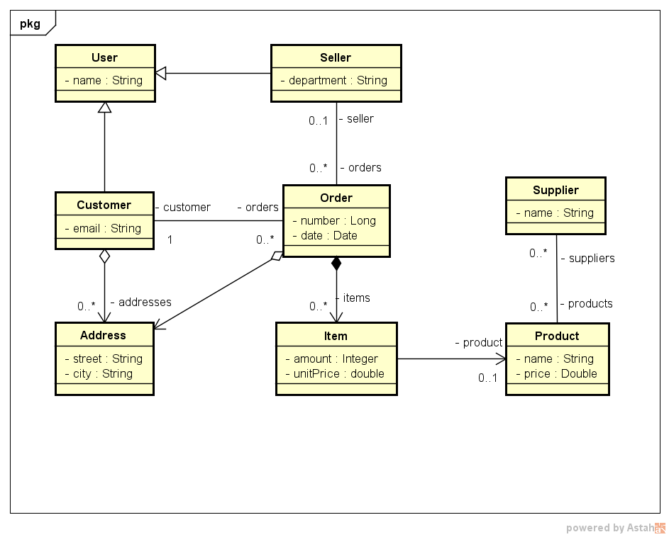

# order_spring_jpa
 

## 💻 Especificações do Projeto

* Um cliente pode fazer um ou mais pedidos de compra.
* Ao criar um pedido de compra, deverá ser alocado o vendedor e a data no qual o pedido foi realizado. 
* Um pedido de compra pode ter um ou mais itens, sendo que o item deve possuir a quantidade e o produto. 
* Um cliente pode possuir vários endereços e o pedido deverá conter um desses endereços para fazer a entrega.
* Todo vendedor possui um departamento.
* E todo produto possui um ou mais fornecedores fornecedor, e todo fornecedor fornece um ou mais produtos.
 

## ✏️ Modelo Conceitual

